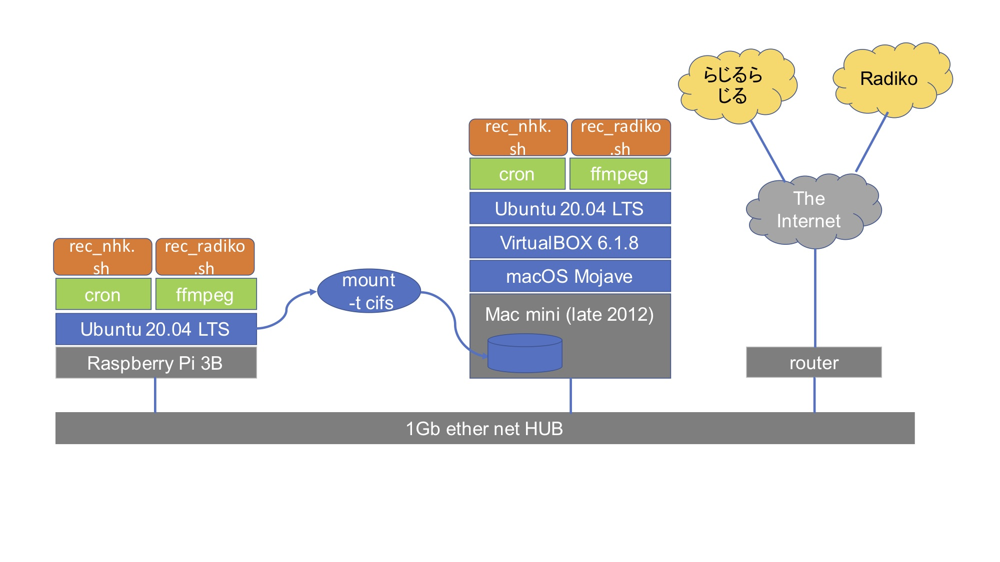

# his.radiko
##全体概要図

	

## 概要
recording Radiko/Radiru-radiru on ubuntu/Raspberry-pi

インターネットでストリーム配信されている<a href="http://radiko.jp/">ラジコ</a>と
<a href="https://www.nhk.or.jp/radio/">らじるらじる</a>を録音する小さなスクリプトです。
<ul>
	<li>ラジコ用: <a href="./rec_radiko.sh">rec_radiko_sh</a></li>
	<li>らじるらじる用: <a href="./rec_nhk.sh">rec_nhk_sh</a></li>
</ul>
  
## 注意事項
録音したデータの取り扱いは、私的使用(著作権法第30条に定めるもの)の範囲内で、
かつ「ユーザー本人による」個人的な視聴の目的に限ること。

## 参考にさせていただいた情報
<ul>
  <li>https://tech.matchy.net/archives/152</li>
  <li>https://gist.github.com/matchy2/3956266</li>
  <li>https://tech.matchy.net/archives/241</li>
  <li>https://gist.github.com/matchy2/9515cecbea40918add594203dc61406c</li>
</ul>

## 何が違うの？
参考にさせていただいたものと、ほぼ同じです(^^;
録音データ形式の変更や、細かな部分を変えているだけです。

## 使い方
<ol>
	<li>cronで定時起動させて録音させます。
		<a href="./crontab-l.sample">サンプルのcrontab</a>を参照ください。</li>
	<li>crontab中の出力先のファイル名や時刻は、適宜変更ください。</li>
</ol>		 

## 動作検証済みの環境
<ul>
	<li>ubuntu 20.04 LTS on Raspberry Pi 2B</li>
	<li>ubuntu 20.04 LTS on Raspberry Pi 3B+</li>
	<li>ubuntu 20.04 LTS on Raspberry Pi 4B(8GB model)</li>
	<li>ubuntu 20.04 LTS on VirtualBox on macmini(late 2012)</li>
</ul>
		
以下、書きかけです。
## 前提環境・必要なソフトウエア
ffmpeg
swftools

## 応用的な使い方
mount -t cifs
mac側でのファイル共有設定
iTunes matchでの利用

## 
